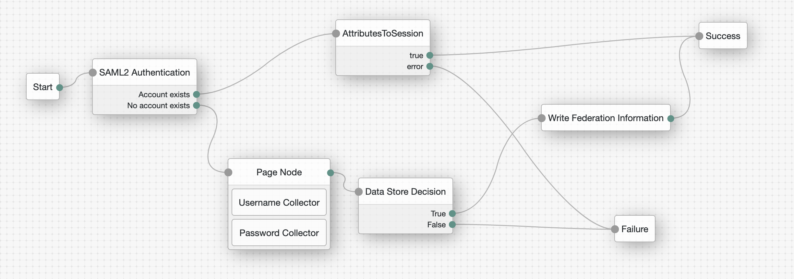

# SAML2 Attributes to Session Properties

## Introduction

This JS Scripted decision node can be used to set the incoming SAML2 Attributes found in an Assertion as Session Properties. This is intented when AM acts as the hosted SP and uses the SAML2 Integrated mode SSO.

Documentation with regards to SAML2 Integrated mode:
- https://backstage.forgerock.com/docs/am/7.2/saml2-guide/saml2-integrated-mode.html

## Contents

Example AM tree



The attached scripted decision node will be used after the successful SAML2 Node authentication. The SAML2 node creates a userInfo object in the shared state that includes all relevant information from the Assertion. For example:
```
{realm=/, authLevel=0, username=demo, userInfo={attributes={phoneNumber=[123], sun-fm-saml2-nameid-info=[sp|idp|C0OTqrtOjICMyBna57thTHleoYxa|idp|urn:oasis:names:tc:SAML:2.0:nameid-format:persistent|null|sp|SPRole|false], email=[demo@example.com], sun-fm-saml2-nameid-infokey=[sp|idp|C0OTqrtOjICMyBna57thTHleoYxa]}, userNames={username=[demo], uid=[demo]}}}
```
(in this example, email and phoneNumber are the SAML2 attribute in the Assertion)

## Configuration

Create an AM scripted decision node using the node in the [src](src) directory

- saml2-attributes-to-session.js

You will also need to whitelist the Session Properties you are expecting as SAML2 attributes from the IdP.
- https://backstage.forgerock.com/docs/am/7/reference/global-services-configuration.html#global-amsessionpropertywhitelist 


## Testing 

Test SAML2 Integrated SSO. The logging when there are 2 attributes in the Assertion:
```
s.A.567fc9d7-4895-466b-9fd6-d6347a23cba8: 2023-02-24 12:00:00,491: Thread[ScriptEvaluator-2]: TransactionId[7c2db561-d230-4877-ab1c-017cc59aeaa4-16611]
ERROR: ***SAML2attributesToSession node executing
s.A.567fc9d7-4895-466b-9fd6-d6347a23cba8: 2023-02-24 12:00:00,492: Thread[ScriptEvaluator-2]: TransactionId[7c2db561-d230-4877-ab1c-017cc59aeaa4-16611]
ERROR: ***SAML2attributesToSession Attributes found in the Assertion.
s.A.567fc9d7-4895-466b-9fd6-d6347a23cba8: 2023-02-24 12:00:00,492: Thread[ScriptEvaluator-2]: TransactionId[7c2db561-d230-4877-ab1c-017cc59aeaa4-16611]
ERROR: ***SAML2attributesToSession Found attribute key phoneNumber with value 123
s.A.567fc9d7-4895-466b-9fd6-d6347a23cba8: 2023-02-24 12:00:00,493: Thread[ScriptEvaluator-2]: TransactionId[7c2db561-d230-4877-ab1c-017cc59aeaa4-16611]
ERROR: ***SAML2attributesToSession Found attribute key email with value demo@example.com
s.A.567fc9d7-4895-466b-9fd6-d6347a23cba8: 2023-02-24 12:00:00,493: Thread[ScriptEvaluator-2]: TransactionId[7c2db561-d230-4877-ab1c-017cc59aeaa4-16611]
ERROR: ***SAML2attributesToSession Session properties set
```

Assuming phoneNumber and email are whitelisted Session properties, you can then check the getSessionInfo call:
```
{
   "username":"demo",
   "universalId":"id=demo,ou=user,ou=am-config",
   "realm":"/",
   "latestAccessTime":"2023-02-24T12:02:55Z",
   "maxIdleExpirationTime":"2023-02-24T12:32:55Z",
   "maxSessionExpirationTime":"2023-02-24T14:02:54Z",
   "properties":{
      "phoneNumber":"123",
      "AMCtxId":"7c2db561-d230-4877-ab1c-017cc59aeaa4-16777",
      "email":"demo@example.com"
    }
}
```